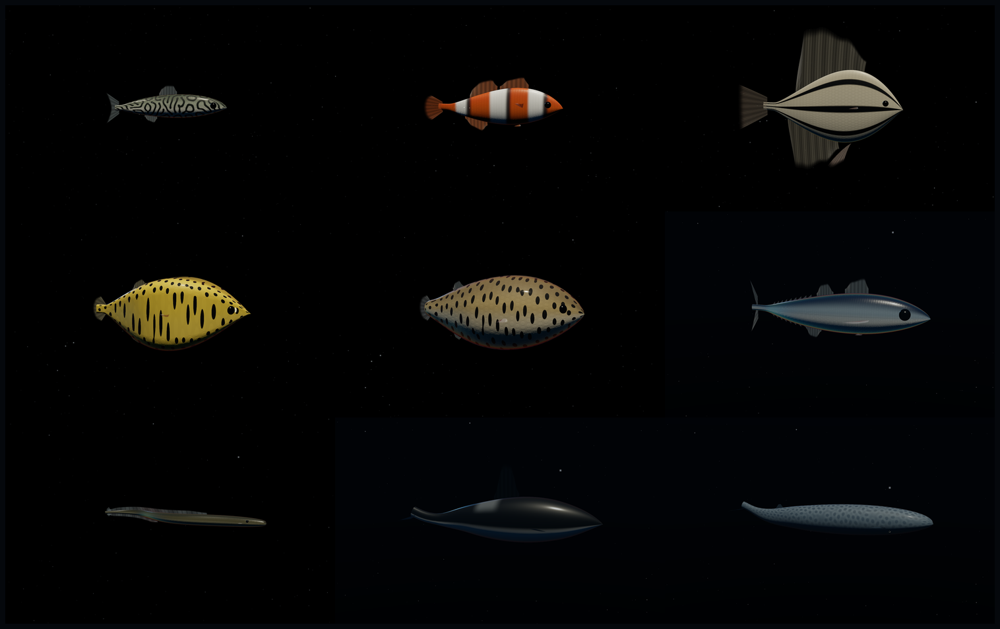
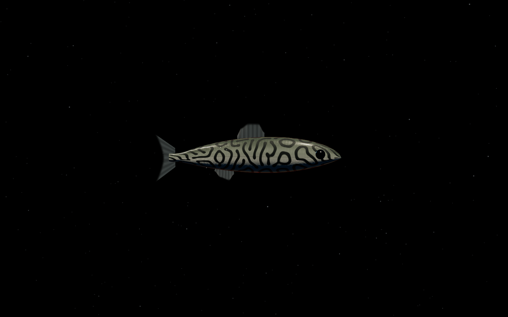
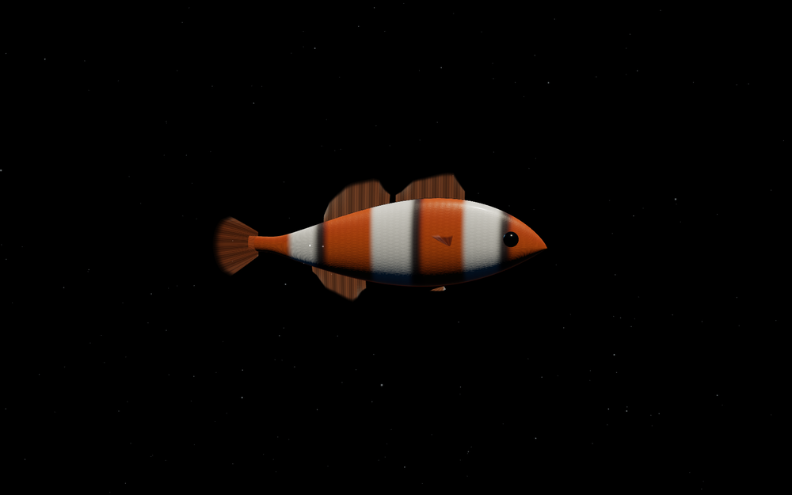
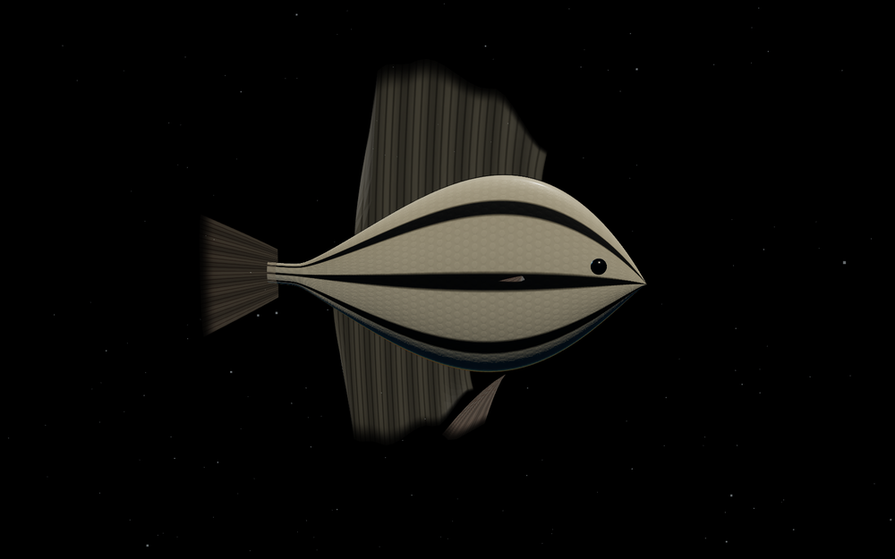
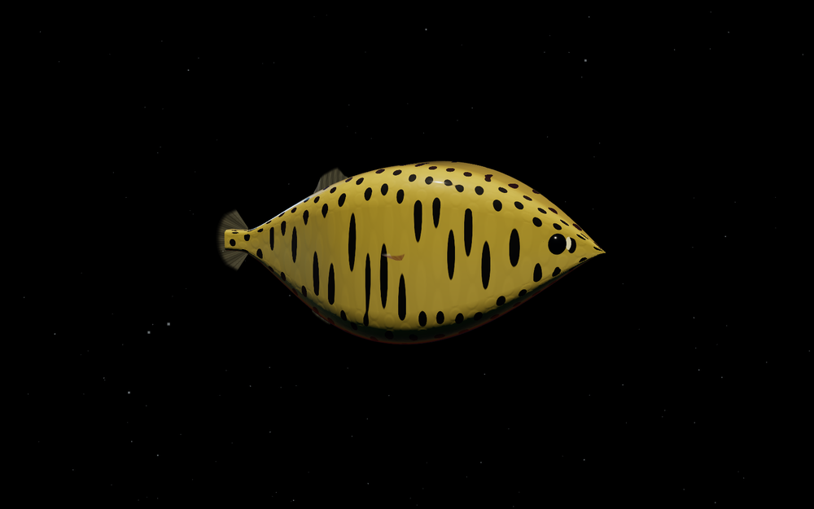
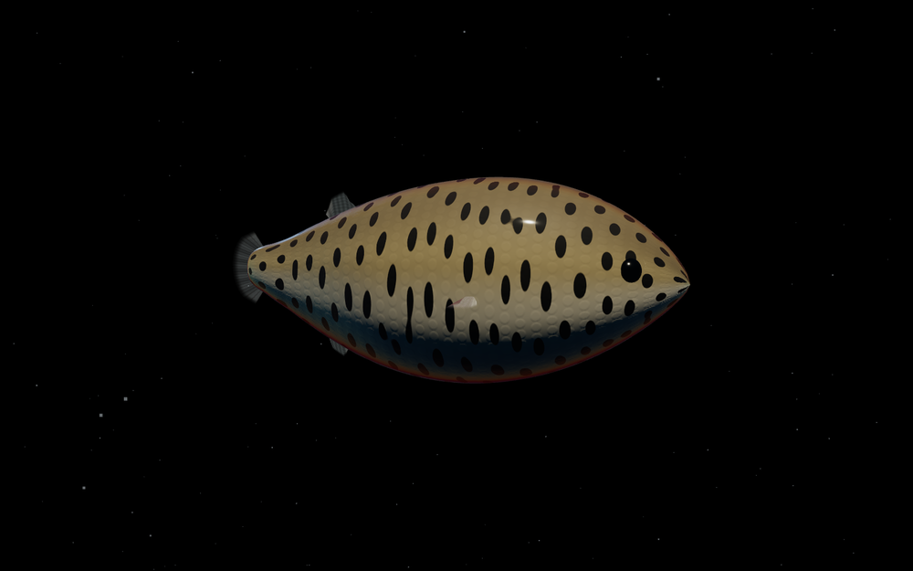
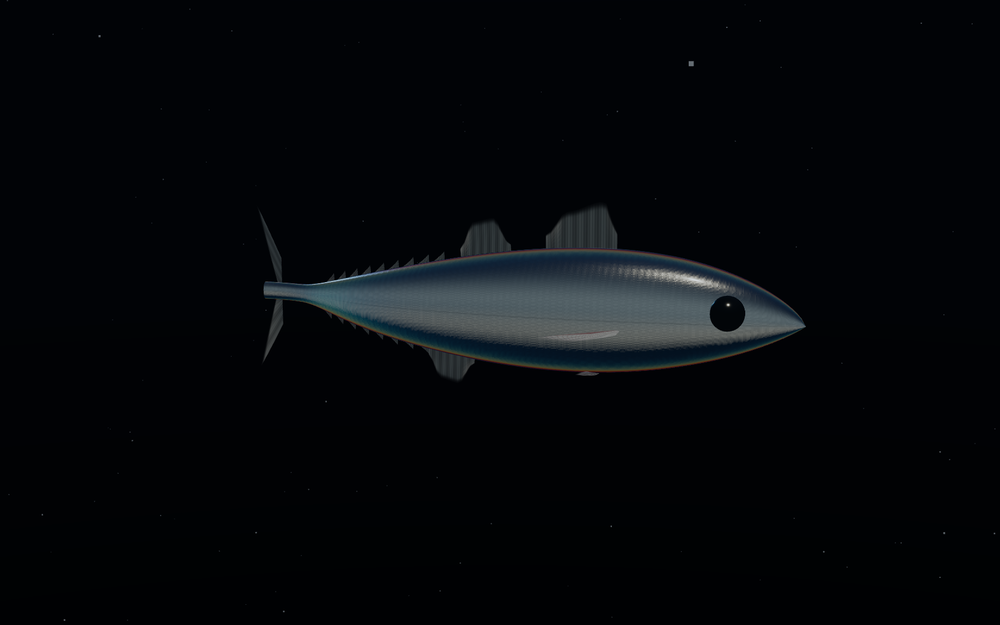
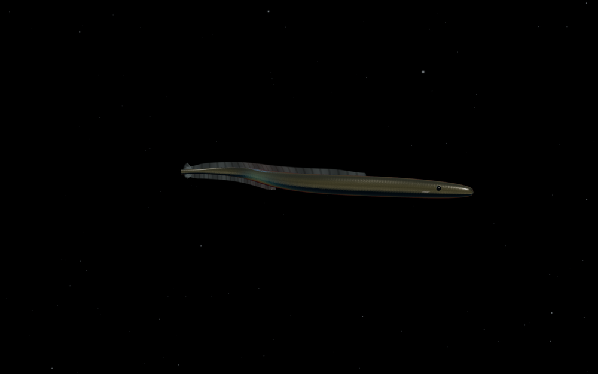
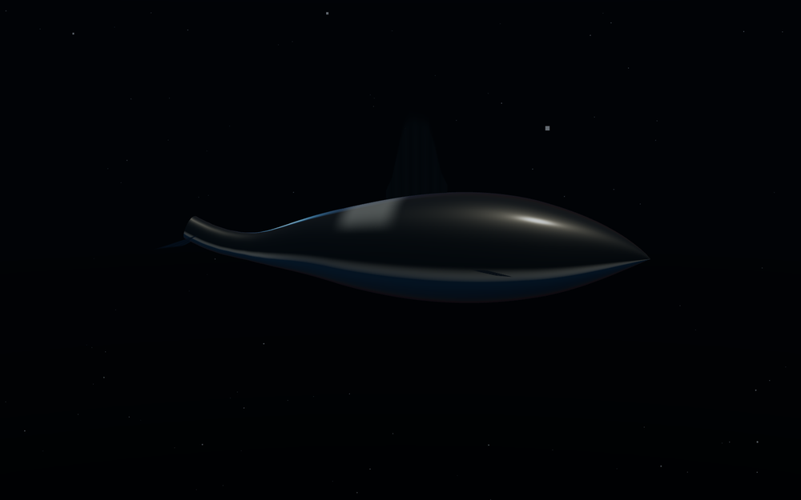
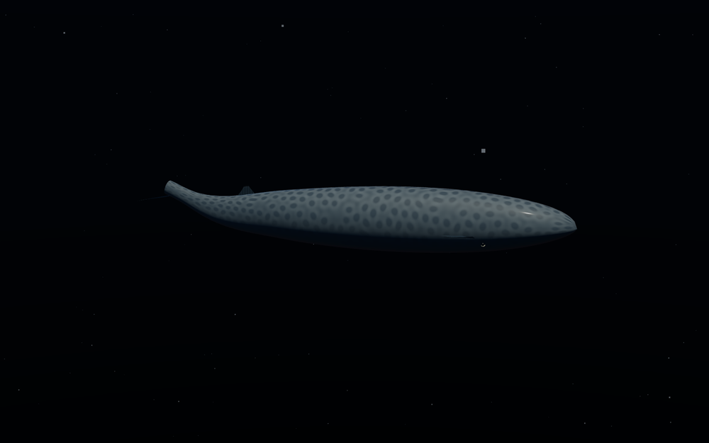

# 🐟 Fish — a parameterized skeletal swim rig

### ▸ Live demo: **[marine.exe.xyz](https://marine.exe.xyz)**  ·  tap a species, drag *blend amount*, then **🔗 copy link to this fish** to share it.

A real-time, biologically-grounded fish rig in Three.js. One adaptable bone-driven,
skinned rig spans **minnow → clownfish → angelfish → boxfish → pufferfish → tuna →
eel → orca → blue whale**, and you can slide continuously between any two of them.
Everything about an animal — its silhouette, fin layout, how it swims, and how its
skin is coloured — is a point in one parameter space.

Built to be **accurate, educational, and beautiful** while staying game-real-time
(one hero animal, orbit camera). Not a museum simulation — a living, tunable toy
that happens to get the biology right.



*All nine species are the same rig at different coordinates. More plates in [`examples/`](examples/) (regenerate with `node scripts/gallery.mjs` while the server runs).*

| | | |
|---|---|---|
|  **Minnow** — subcarangiform, forked tail, vermiculated skin |  **Clownfish** — leucophore bars, not a Turing pattern |  **Angelfish** — compressiform disc, tall sails, RD bars |
|  **Boxfish** — ostraciiform, rigid carapace, aposematic spots |  **Pufferfish** — globiform, inflatable, no pelvic girdle |  **Tuna** — thunniform, lunate tail, finlets, iridophore sheen |
|  **Eel** — anguilliform, continuous median fringe |  **Orca** — cetacean, dorsoventral, horizontal fluke |  **Blue whale** — slender rorqual, mottled skin, tiny far-aft dorsal |

## Run it

```bash
npm install      # three + lil-gui
npm start        # static server on http://localhost:5173
```

Open the URL. Orbit with the mouse; everything else is in the control panel.
No build step — the browser loads ES modules directly.

```bash
npm run smoke    # Node: builds geometry + poses the skeleton for every species, checks for NaNs
```

There are also two headless-Chrome checks used during development
(`scripts/browsercheck.mjs` shoots every species; `scripts/motioncheck.mjs`
confirms the spine actually animates).

## What it does

- **Unified skinned rig from scratch.** A procedural cross-section tube skinned to a
  spine, with no imported meshes. The spine is rooted at the **recoil pivot** (~23%
  back from the snout, where real fish pivot), with a forward branch to the head and
  a back branch to the tail, so the head counter-sways against the tail on its own.
- **Traveling-wave locomotion.** The backbone follows
  `lateral(s,t) = ½·A(s)·L·sin(2π·waves·s − ωt)`. Sliding the number of `waves` on
  the body and an anterior-stiffness knob walks continuously through the BCF modes:
  **anguilliform → subcarangiform → carangiform → thunniform → ostraciiform**.
- **One plane knob for cetaceans.** `swim.plane` rotates the spinal bending axis and
  rolls the tail from a vertical fish caudal fin to a horizontal whale fluke — the
  same rig swims a tuna side-to-side and an orca up-and-down.
- **Modular fin sockets.** Dorsal, second dorsal, anal, pectoral, pelvic, caudal,
  plus finlets (tuna) and a continuous dorsal-caudal-anal fringe (eel). Every fin is
  a `SkinnedMesh` bound to the same spine, so body undulation carries it; on top of
  that each fin trails under drag, driven by its socket's *velocity* — which is a
  quarter-cycle behind displacement, reproducing the measured dorsal/anal fin lag
  with no hand-tuned delay.
- **Live reaction-diffusion skin.** A GPU Gray-Scott simulation runs every frame; the
  fish samples it as a melanophore mask. Anisotropic diffusion combs it into
  head-to-tail stripes or dorsoventral bars. Patterns grow and rearrange the way
  Kondo & Asai filmed on a live angelfish.
- **Layered chromatophore shading.** Countershaded base → melanophore pattern →
  xanthophore (warm pigment) → leucophore markings (clownfish bars, orca patches) →
  iridophore thin-film sheen, over a physical clearcoat "mucus" layer with
  procedural scales.

## Controls (panel)

| Folder | What |
|---|---|
| **explore** | pick a species; pick another to *blend toward*; drag *blend amount* to morph |
| **locomotion** | BCF mode, speed (BL/s), Strouhal number, waves on body, amplitude, anterior stiffness, swim plane (lateral↔dorsoventral), turn, idle drift |
| **body shape** | length, back/belly depth, width-to-depth, boxiness, inflation, girth |
| **pattern** | Gray-Scott preset, feed `F`, kill `k`, anisotropy (bars↔stripes), threshold, contrast, live-evolve toggle, reseed |
| **surface** | body/pattern colours, countershading, iridescence, warm pigment, mucus clearcoat, roughness, scales, translucency, lateral line |
| **scene** | auto-rotate, pause, marine snow, reset camera |

`window.FISH` is exposed for console tinkering (`FISH.setSpecies('orca')`, `FISH.params`).

## Architecture

```
src/
  core/
    math.js        superellipse, beta-bump silhouette, smoothMax, tree-lerp (morphing)
    params.js      THE parameter space: envelope A(s), Strouhal→frequency, BCF modes,
                   Gray-Scott presets, morphParams()
  species/
    presets.js     nine species as points in that space (anatomy from the research below)
  rig/
    profile.js     rest-pose silhouette: dorsal/ventral curves, width, inflation (no THREE)
    geometry.js    skinned cross-section tube: rings, UVs, 2-bone skin weights, seam-welded normals
    skeleton.js    spine rooted at the recoil pivot; pose() traces a centreline by finite differences
    swim.js        the traveling-wave Swimmer: centreline(s), lateralVel(s), finDrive(s)
    fins.js        fin membranes (ridge / caudal / paired / finlets), skinned + trailing deformation
    FishRig.js     assembles body + spine + fins + eyes; one update(dt)
  pattern/
    reactionDiffusion.js   GPU ping-pong Gray-Scott, anisotropic, bounded-stable
  shading/
    FishMaterial.js        MeshPhysicalMaterial + onBeforeCompile: layered pigment stack,
                           procedural scales, fresnel iridescence, translucent fin membrane
  scene/
    environment.js         gradient water dome, depth fog, sun-through-water lights, marine snow
  main.js          scene, camera, GUI, RD wiring, render loop
```

### Design decisions worth knowing

- **Amplitudes are peak-to-peak** (matching the biology literature). Lateral offset is
  half. Getting this wrong makes a fish swim like it is having a seizure.
- **Materials are created once and reused** across every rebuild. Structural edits
  (body shape, fins, morph) rebuild geometry only and refresh uniforms — no shader
  recompile, so dragging a slider never hitches.
- **Anisotropic diffusion uses a bounded split** (`ax+ay=2`) instead of `ax=a, ay=1/a`.
  The unbounded form destabilises the explicit diffusion step for `a<1` and the field
  saturates into a solid mask instead of forming stripes. This one fix is what makes
  the angelfish bars and minnow vermiculation appear at all.

## The biology (and where it came from)

Numbers below are baked into `core/params.js` and `species/presets.js`.

**Locomotion.** Amplitude envelope `A(s) = 0.05 − 0.13s + 0.28s²` (peak-to-peak, body
lengths) — the 44-species empirical fit from **Di Santo et al. 2021, *PNAS* 118(49)**.
Its negative linear term puts the recoil node at s≈0.23. BCF wavelengths (anguilliform
λ≈0.75L … thunniform λ≈1.14L) from the same paper and **Sfakiotakis, Lane & Davies
1999, *IEEE J. Oceanic Eng.* 24(2)**. Frequency from the Strouhal number
`St = f·A/U`, with animals clustering at St 0.2–0.4 (**Taylor, Nudds & Thomas 2003,
*Nature* 425**; thunniform optimum 0.25–0.35, **Triantafyllou et al. 1993**). Snout
yaw kept at ~3% BL even on sleek swimmers (Di Santo 2021).

**Cetaceans.** Dorsoventral fluke oscillation, horizontal fluke, posterior-third
flexion, fluke pitch zero at max displacement / maximal mid-stroke (so velocity-driven
trailing gives correct fluke pitch), amplitude ~0.15–0.25 BL, St clustering 0.225–0.275
— **Fish 1998 *JEB* 201(20)**; **Rohr & Fish 2004 *JEB* 207(10)**; **Fish & Rohr 1999**.

**Fin behaviour.** Dorsal/anal fins as roll/yaw stabilisers producing mostly lateral
force with a 21–28% tailbeat phase lag; pectoral rowing vs flapping (labriform) —
**Standen & Lauder 2007**; **Drucker & Lauder 2005**; **Walker & Westneat 2002**.

**Anatomy.** Fin socket positions (pelvic abdominal↔thoracic↔jugular, dorsal splits,
adipose, finlets), caudal-shape series (rounded→lunate) vs swimming style, body-form
archetypes (fusiform / anguilliform / compressiform / globiform), and cetacean body
plan — synthesised from **Helfman et al. *The Diversity of Fishes***, **FishBase**, the
**AFS Fishionary**, and species sources (FAO tuna synopsis, Florida Museum, SeaWorld,
Woodward et al. on rorqual proportions).

**Pattern.** Gray-Scott `∂U/∂t = Du∇²U − UV² + F(1−U)`, `∂V/∂t = Dv∇²V + UV² − (F+k)V`,
Du:Dv = 2:1, F/k presets from **Pearson 1993** classes and **Karl Sims'** catalogue
(spots 0.030/0.062, worms 0.046/0.063, holes 0.039/0.058, …). Anisotropy → stripe
orientation from **Shoji, Iwasa & Kondo 2002, *JTB* 214**. Living-pattern justification
from **Kondo & Asai 1995, *Nature* 376** (the marine angelfish *Pomacanthus*). Layered
chromatophore recipe (melanophore / xanthophore / erythrophore / iridophore /
leucophore) from Fujii and the Australian Museum.

## Where it's going

See [`ROADMAP.md`](ROADMAP.md). The near-term direction is a **genome + breeding** game:
a fish already *is* its parameter tree, so serializing it to a shareable code and
cross-breeding two of them is a small step that turns the demo into a toy.

### North star — expressiveness

Reference for where we'd like the *feeling* to get someday:
[**Yellow Tang (Sketchfab)**](https://sketchfab.com/3d-models/yellow-tang-coral-fish-1465b11201464ccb97e88c048c4656ba).
Watch the details our procedural approach doesn't yet capture: motion that isn't
robotic (a sudden twitch of propulsion, then a lazy glide), fins fluttering in a
non-linear, ductile way rather than a clean sine, gills working, a small mouth opening
and closing, eyes darting. Some of this is reachable from here — non-robotic timing and
secondary fin jitter are layers on the existing rig — but a genuinely expressive **head**
(jaw, mouth cavity, gill covers, eye sockets) is beyond a single procedural tube and
likely needs a dedicated head module. Kept here as the bar to aim at.

## Known limitations / next steps

- Fin membranes trail plausibly but don't yet have per-ray splay/fold (erecting and
  collapsing the dorsal, spreading the caudal lobes).
- Reaction-diffusion runs in UV space; a hero fish would benefit from running it on the
  mesh surface with a curvature-aligned flow field (Krause et al. 2024) to remove the
  last UV-seam stretching near the tail.
- Iridescence is a fresnel approximation, not full multilayer thin-film.
- No schooling / no environment interaction — this is one animal in place, by design.
